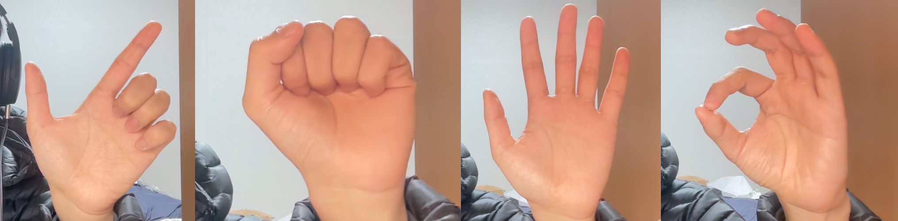

### Project Overview

Music remixing is increasingly being commercialized through the integration of AI-based **source separation** technologies. The advantage of music remixing using source separation is that it allows users to creatively recompose any music they want, even if they are not the original composer or do not possess the project's files.

### Demo Video

<iframe 
    width="560" 
    height="315" 
    src="https://www.youtube-nocookie.com/embed/GxLz06DpePw" 
    frameborder="0" 
    allow="accelerometer; autoplay; clipboard-write; encrypted-media; gyroscope; picture-in-picture" 
    allowfullscreen>ㅉㅉㅉㅉ
</iframe>

### Design

The screen is divided into appropriate regions, and the separated stems are mapped to these regions. Users can manipulate individual stems through conducting gestures in these regions.

### Gestures



- Solo, Mute, Play, Conducting Gestures(as shown in the image) are currently supported.

### How to use

```
git clone https://github.com/hoyso48/music_remixing_with_conducting_gestures.github.io.git
cd src
pip install -r requirements.txt
python main.py
```

All you need to do is run the above commands and specify the audio file path(mp3, wav, flac) you want to remix. It will takes a few minutes to preprocess the audio file when you load the audio file for the first time.

### Technical Details

*   Source Separation: HT Demucs by Meta, 2022.[^1]
*   Hand Landmark Detection: Mediapipe by Google, 2019.[^2]

[^1]: Rouard, S., Massa, F., & Défossez, A. (2022). Hybrid Transformers for Music Source Separation. arXiv preprint arXiv:2211.08553. https://arxiv.org/abs/2211.08553

[^2]: Fanello, S., Gall, J., Lugaresi, C., & Sokol, E. (2019). MediaPipe: A Framework for Building Perception Pipelines. Google Research. https://mediapipe.dev
